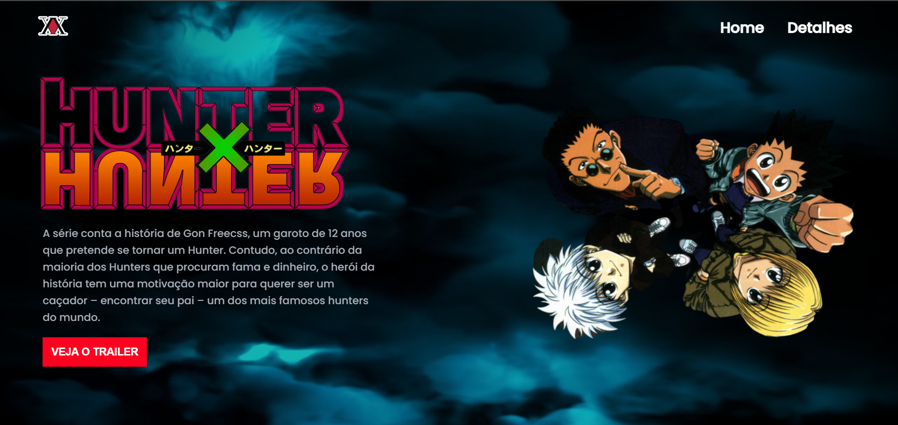
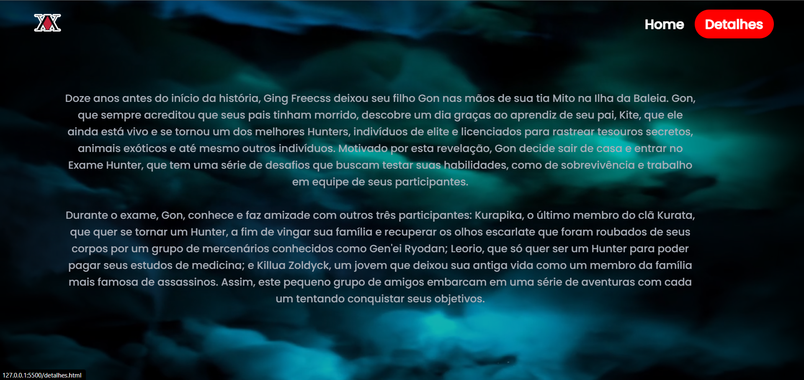

# Hunter x Hunter

Bem-vindo ao projeto do site sobre o anime *Hunter x Hunter*. Este site foi criado para oferecer uma visão geral do anime, incluindo uma breve descrição e o trailer oficial.





## Descrição do Projeto

Este site é uma plataforma dedicada aos fãs de *Hunter x Hunter* e aos interessados no anime. O objetivo é fornecer informações relevantes e uma maneira fácil de assistir ao trailer oficial do anime. 

### Recursos do Site

- **Descrição do Anime:** Uma breve descrição do *Hunter x Hunter*, abordando a trama, personagens principais e o universo do anime.
- **Trailer do Anime:** Uma seção dedicada ao trailer oficial do anime, permitindo que os visitantes assistam ao vídeo diretamente no site.
- **Design Moderno:** O site possui um design moderno e responsivo, garantindo uma experiência agradável em diferentes dispositivos.

## Tecnologias Utilizadas

- **HTML:** Estrutura do site.
- **CSS:** Estilização e layout do site.
- **JavaScript:** Funcionalidades interativas e dinâmicas.

## Como Executar o Projeto

1. Clone o repositório:
   ```bash
   git clone https://https://github.com/anavitoriasantos/projeto-hunterxhunter
